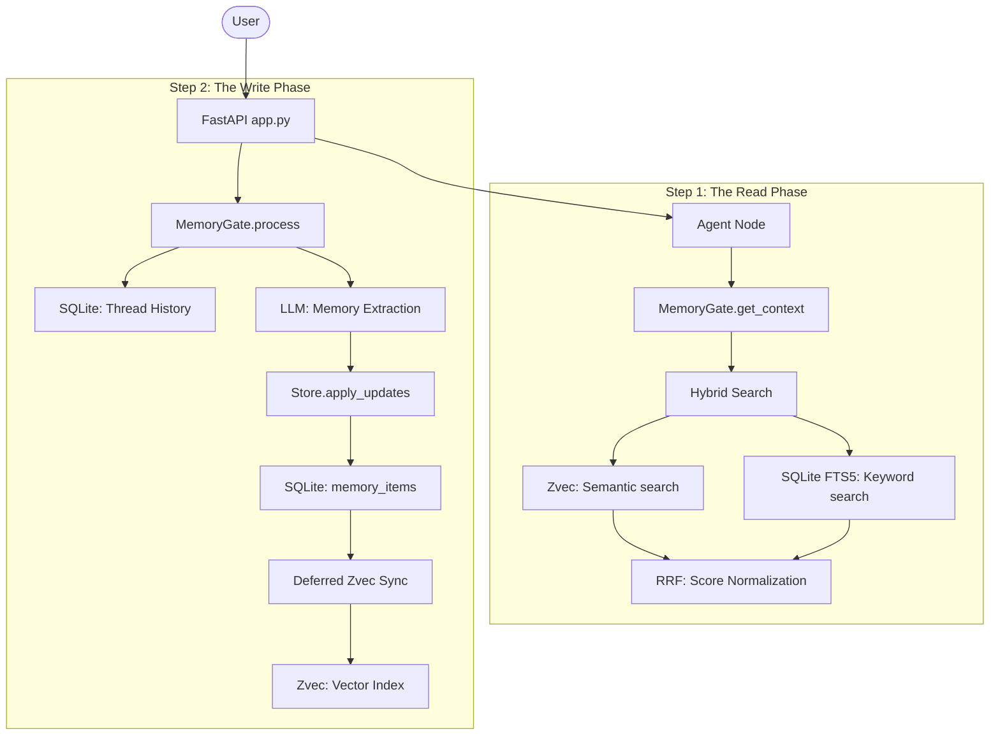

# INDRA Memory Architecture: Deep Dive

## High-Level Overview

INDRA uses a **Triple-Tiered Memory System** designed for high durability, semantic relevance, and exact-keyword precision.

---

## Timeline of a Conversation Turn

The architecture ensures that the user never waits for vector indexing. It strictly separates **Pre-Response Reads** from **Post-Response Writes**.

### 1. Step 1: Pre-Response (The READ Phase)
*Synchronous: Happens instantly before the AI generates text.*

1.  **Context Fetch**: [agent_node](file:///Users/chetan/Documents/GitHub/project_INDRA/nodes/agent.py#138-267) calls `memorygate.get_context()`.
2.  **History Read**: SQLite fetches the last 6 messages (`thread_history`) for conversational continuity.
3.  **Memory Search**: 
    *   **Zvec READ**: Finds semantically similar facts by embedding the user's latest message. 
    *   **FTS5 READ**: Finds exact-match keywords (UUIDs, technical terms) that vectors might miss.
4.  **Skill Match**: Queries `zvec_skills`. The **0.75 threshold** filters out generic prompts, ensuring only strict semantic matches trigger tool logic.
5.  **Prompt Assembly**: All read data is concatenated into the System Prompt for the LLM.

### 2. Step 2: Post-Response (The WRITE Phase)
*Asynchronous: Runs in the background AFTER the user receives their response.*

1.  **History Write**: User and AI messages are committed to `thread_history`.
2.  **Extraction**: The turn is analyzed by the Memory Agent. 
3.  **Semantic Deduplication**: Before writing, INDRA performs a cosine similarity check against existing `memory_items`. If a new fact matches an existing one by **>0.92**, it simply updates the `updated_ts` of the existing row.
4.  **Local Storage**: Truly new facts are written to `memory_items` with `indexed=0`. These are now keyword-searchable via FTS5 but not yet vector-searchable.
4.  **Vector Sync**:
    *   [sync_pending_memories()](file:///Users/chetan/Documents/GitHub/project_INDRA/memory.py#508-540) fetches the `indexed=0` rows.
    *   **Bulk Embedding**: All new texts are embedded in one batch (most CPU-intensive part).
    *   **Zvec WRITE**: The batch is `upsert()`ed and `flush()`ed to disk.
    *   **Final SQLite WRITE**: Rows are marked `indexed=1`.

---

## 1. Core Components

### [DatabaseClient](file:///Users/chetan/Documents/GitHub/project_INDRA/memory.py#74-285) (The System of Record)
SQLite is the **source of truth**. All data must land here before being indexed elsewhere.
- **WAL Mode**: Uses Write-Ahead Logging for high concurrency.
- **`memory_items` Table**: Stores rich metadata (Kind, Confidence, Status).
- **`memory_fts` (FTS5)**: A virtual table that implements BM25 ranking for keyword searches.
- **Tombstones**: Deletion is "logical" (`status='tombstoned'`), not "physical," preventing data loss while excluding obsolete facts from retrieval.

### [ZvecMemoryStore](file:///Users/chetan/Documents/GitHub/project_INDRA/memory.py#296-649) (The Semantic Index)
Zvec is a C++ powered in-process vector database used for Approximate Nearest Neighbor (ANN) search.
- **FastEmbed**: Uses a local `bge-small-en-v1.5` model to generate 384-dimension embeddings.
- **Integrity Probes**: On startup, it performs a "dual-path" probe (Fetch + Query). If Zvec returns a checksum error or silent corruption, it is wiped and rebuilt from SQLite.
- **Deferred Sync**: Writes are batched at the end of a conversation turn to avoid write-lock contention.

### [MemoryGate](file:///Users/chetan/Documents/GitHub/project_INDRA/memory.py#654-728) (The Orchestrator)
The high-level interface used by [app.py](file:///Users/chetan/Documents/GitHub/project_INDRA/app.py) and [agent.py](file:///Users/chetan/Documents/GitHub/project_INDRA/agent.py).
- **[process()](file:///Users/chetan/Documents/GitHub/project_INDRA/memory.py#670-700)**: Runs in the background (via `asyncio.create_task`) after every turn. It manages extraction, history writing, and Zvec syncing.
- **[get_context()](file:///Users/chetan/Documents/GitHub/project_INDRA/memory.py#701-724)**: Merges recent history with hybrid semantic context for the LLM.

---

## 2. The Data Lifecycle

### Phase A: Retrieval (Pre-Generation)
When you send a message:
1.  **History Lookup**: The last 6 messages are fetched from SQLite.
2.  **Hybrid Search**:
    *   **Vector**: Your query is embedded and Zvec finds top-K matches by cosine similarity.
    *   **Keywords**: SQLite FTS5 finds matches for exact terms.
    *   **Normalization (RRF)**: Scores are unified using **Reciprocal Rank Fusion** (`1 / (60 + rank)`). This merges the unbounded BM25 scores with bounded cosine similarity scores without bias.
3.  **Merge & Dedup**: Matches are unified based on RRF rank.
4.  **Skill Injection**: A separate Zvec query finds matching skills (e.g., `google_workspace`). A **0.75 threshold** prevents generic greetings from matching.

### Phase B: Extraction (Post-Generation)
After the assistant responds:
1.  **Context Loading**: The turn (User msg + AI msg) is fed to a specialized "Memory Extraction Agent".
2.  **Semantic Check**: Extracted facts are queried against Zvec. If a match is found with **similarity > 0.92**, the system "touches" the existing record (`updated_ts`) instead of creating a duplicate.
3.  **Kind Classification**: New facts are tagged as `pref` (preferences), `fact` (knowledge), or `rule` (corrections).
4.  **SQLite First**: The facts are written to `memory_items` with `indexed=0`.

### Phase C: Persistence (Deferred Sync)
1.  **Sync Trigger**: Once the turn is finished, [app.py](file:///Users/chetan/Documents/GitHub/project_INDRA/app.py) calls [sync_pending_memories()](file:///Users/chetan/Documents/GitHub/project_INDRA/memory.py#508-540).
2.  **Batch Embed**: All `indexed=0` items are gathered and embedded in a single batch.
3.  **Locked Writes**: A Zvec write-lock is acquired, items are `upsert()`ed, and a `flush()` is called.
4.  **Confirmation**: Only after Zvec confirms the write is the SQLite row marked `indexed=1`.

---

## 3. Resilience & Self-Healing

| Failure Case | Mitigation Strategy |
| :--- | :--- |
| **Zvec Corruption** | Integrity Probes rebuild index from SQLite on boot. |
| **App Crash mid-write** | `indexed=0` flag ensures items are re-synced on next turn. |
| **Write Lock Contention** | Deferred sync moves heavy vector writes outside the main request path. |
| **Skill Drift** | Similarity threshold (**0.75**) ignores weak matches. |
| **Fact Duplication** | Semantic similarity check (**>0.92**) updates `updated_ts` instead of duplicating rows. |
| **Obsolete Memory** | Tombstoning preserves history while hiding data from retrieval. |
